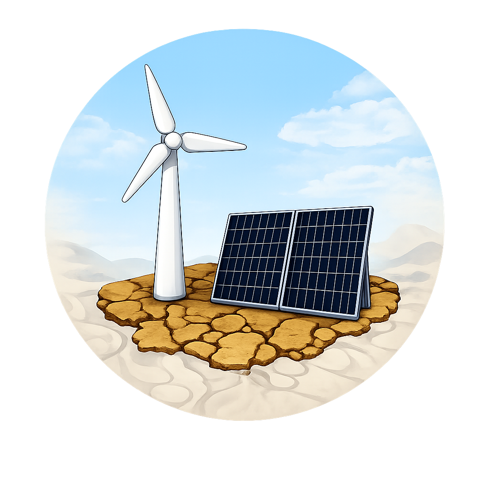
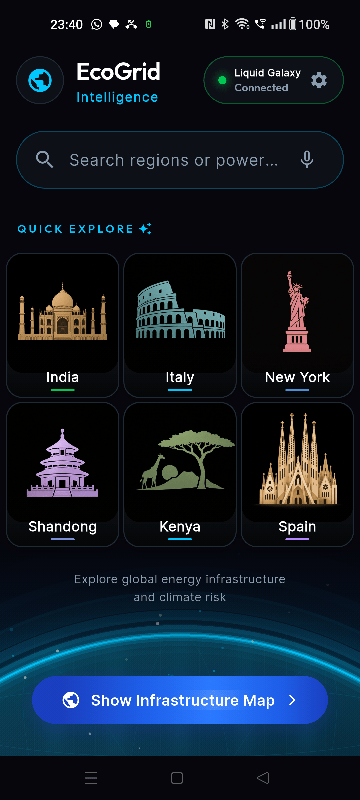
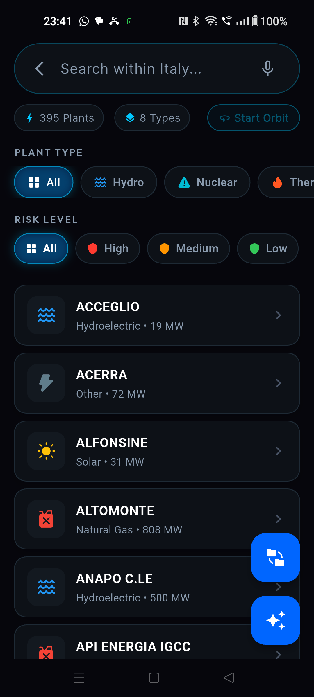
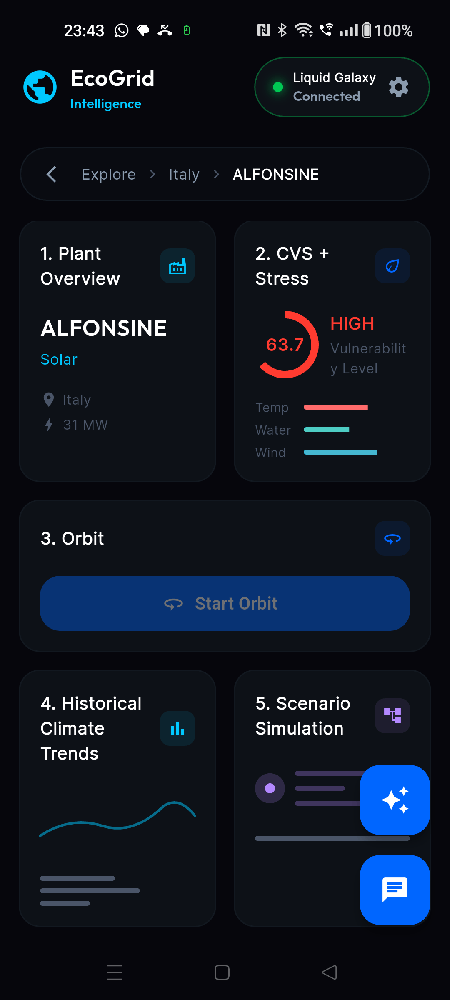
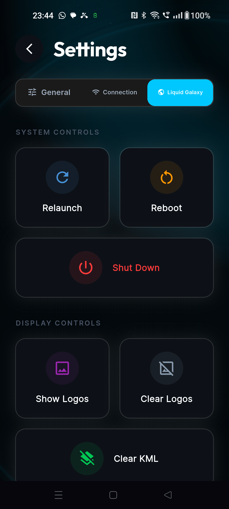
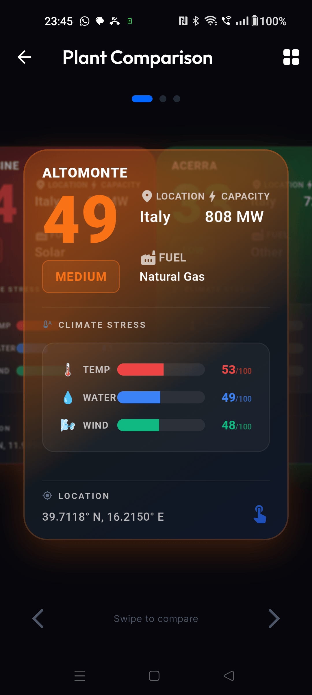
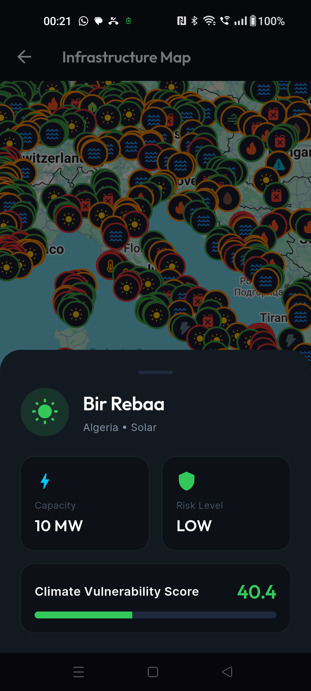

<div align="center">
  

  # EcoGrid Intelligence

  **AI-Driven Climate Resilience Analysis for Global Energy Infrastructure on Liquid Galaxy**

  [](https://flutter.dev)
  [](https://dart.dev)
  [](https://ai.google.dev)
  [](https://www.liquidgalaxy.eu)
  [](LICENSE)

  *A Google Summer of Code 2026 project under [Liquid Galaxy LAB](https://www.liquidgalaxy.eu)*
</div>

---

## 🌍 About

EcoGrid Intelligence is a Flutter application built for the **Liquid Galaxy** platform that lets researchers and policymakers interactively explore global energy infrastructure through the lens of climate resilience.

It combines **34,000+ power plants** from the Global Power Plant Database with **real-time climate data**, a custom **Climate Vulnerability Score (CVS)** engine, and **Gemini AI** insights — all visualized across a multi-screen Liquid Galaxy rig via dynamic KML overlays.

---

## ✨ Features

<table>
<tr>
<td width="50%">

### 🔌 Liquid Galaxy Integration
- SSH-based connection to control the LG rig
- Dynamic KML deployment to master & slave screens
- 3D extruded region boundaries from real GeoJSON
- Smooth camera orbits around plants & regions
- Automated comparison tours between plants
- Logo overlays and HTML info balloons

</td>
<td width="50%">

### 🤖 AI-Powered Insights
- Conversational chat with Gemini AI per plant
- Context-aware prompts with CVS, climate & metadata
- Scenario simulation narratives
- Text-to-Speech readout of AI responses
- Speech-to-Text for voice-based search

</td>
</tr>
<tr>
<td>

### 📊 Climate Vulnerability Score (CVS)
- Custom scoring engine with **15-fuel-type sensitivity matrix**
- Real climate data from Open-Meteo API
- Anomaly Engine — P90 peaks, drought ratios, gust frequency
- Per-dimension stress breakdown (temp / water / wind)
- Scenario simulation with adjustable multipliers

</td>
<td>

### 🗺️ Rich Visualization
- Interactive Google Maps with fuel-type icon markers
- Risk-colored marker rings (Low → Critical)
- Historical climate trend charts (fl_chart)
- Plant comparison side-by-side view
- Animated globe background (custom painter)

</td>
</tr>
</table>

**Plus:** Dark/Light theming · Localization (EN, ES, DE) · Guided FTUE tour · Secure API key management · Drift (SQLite) caching · Clean Architecture with BLoC

---

## 📸 Screenshots

<div align="center">
<table>
  <tr>
    <td align="center" width="33%">
      <br/>
      <b>🏠 Home — Quick Explore</b><br/>
      <sub>Browse regions at a glance with voice search & LG status</sub>
    </td>
    <td align="center" width="33%">
      <br/>
      <b>🔍 Region Explorer</b><br/>
      <sub>Filter plants by fuel type & risk level within any region</sub>
    </td>
    <td align="center" width="33%">
      <br/>
      <b>📊 Plant Dashboard</b><br/>
      <sub>CVS score, climate trends, orbit controls & AI insights</sub>
    </td>
  </tr>
  <tr>
    <td align="center" width="33%">
      <br/>
      <b>⚙️ Settings — LG Controls</b><br/>
      <sub>System controls, display management & KML operations</sub>
    </td>
    <td align="center" width="33%">
      <br/>
      <b>⚖️ Plant Comparison</b><br/>
      <sub>Side-by-side swipeable cards with climate stress breakdown</sub>
    </td>
    <td align="center" width="33%">
      <br/>
      <b>🗺️ Infrastructure Map</b><br/>
      <sub>Interactive map with fuel-type markers & risk-colored rings</sub>
    </td>
  </tr>
</table>
</div>

---

## 🏗️ Architecture

```
lib/
├── config/          # Theme, routes, localization
├── core/            # Constants, enums, utilities, KML generation
├── data/            # Remote (Gemini, Open-Meteo) & local (Drift DB) sources
├── di/              # Dependency injection (get_it)
├── domain/          # Models, repository interfaces, use cases
├── presentation/    # UI screens, BLoC state management, components
├── service/         # LG, SSH, TTS, STT, Tour services
└── main.dart
```

The app follows **Clean Architecture** with clear separation between data, domain, and presentation layers. State management uses the **BLoC pattern** throughout.

---

## 🚀 Getting Started

### Prerequisites

- Flutter SDK **3.12+**
- Android Studio / VS Code
- A Google **Gemini API key** ([get one here](https://ai.google.dev))
- A Google **Maps API key** ([get one here](https://console.cloud.google.com))
- *(Optional)* A Liquid Galaxy rig for LG features

### Installation

```bash
# 1. Clone the repository
git clone https://github.com/LiquidGalaxyLAB/ecogrid-intelligence.git
cd ecogrid-intelligence

# 2. Install dependencies
flutter pub get

# 3. Configure Google Maps API Key
# Open `android/app/src/main/AndroidManifest.xml` and locate line ~40.
# Replace `YOUR_MAPS_API_KEY` with your actual Google Maps API key.

# 4. Run the app
flutter run
```

> [!IMPORTANT]
> **API Keys Configuration**
> The **Google Maps API key** must be added directly into the `AndroidManifest.xml` file before running the app due to Android's native SDK requirements. The **Gemini API key**, however, can be configured later directly inside the app at runtime by going to **Settings → General → API Keys**.

### Connecting to Liquid Galaxy

1. Open the app and navigate to **Settings** (gear icon)
2. Enter your LG rig's **IP address**, **SSH port**, **username**, and **password**
3. Set the **screen count** to match your rig
4. Tap **Connect** — the status pill will turn green when connected

---

## 🛠️ Tech Stack

| Layer | Technology |
|-------|-----------|
| **Framework** | Flutter 3.12+ / Dart |
| **State Management** | flutter_bloc, bloc_concurrency |
| **AI** | Google Gemini API (native REST) |
| **Maps** | google_maps_flutter |
| **SSH / LG** | dartssh2 (SSH + SFTP) |
| **Local DB** | Drift (SQLite) |
| **Charts** | fl_chart |
| **DI** | get_it |
| **Networking** | Dio |
| **Voice** | speech_to_text, flutter_tts |
| **Storage** | flutter_secure_storage, shared_preferences |

---

## 📂 Key Components

| Component | Description |
|-----------|-------------|
| [`LGService`](lib/service/lg_service.dart) | Full LG lifecycle — connection, KML deployment, camera control, orbits, tours |
| [`SSHService`](lib/service/ssh_service.dart) | SSH connection with serialization lock and atomic SFTP uploads |
| [`KmlUtils`](lib/core/utils/kml_utils.dart) | KML generation — regions, placemarks, balloons, tours, overlays |
| [`CVSCalculator`](lib/core/utils/cvs_calculator.dart) | Climate Vulnerability Score engine with fuel-type sensitivity matrix |
| [`AnomalyEngine`](lib/core/utils/anomaly_engine.dart) | Statistical climate anomaly computation from historical data |
| [`RegionBoundaryService`](lib/core/utils/region_boundary_service.dart) | Real country borders from Nominatim → 3D extruded KML |
| [`GeminiApiService`](lib/data/remote/api_services/gemini_api_service.dart) | Abstracted Gemini API transport layer |

---

## 👨‍💻 Contributing

Contributions are welcome! Please:

1. Fork the repository
2. Create a feature branch (`git checkout -b feat/amazing-feature`)
3. Commit your changes (`git commit -m 'feat: add amazing feature'`)
4. Push to the branch (`git push origin feat/amazing-feature`)
5. Open a Pull Request

---

## 📜 License

This project is developed as part of **Google Summer of Code 2026** under the **Liquid Galaxy LAB** organization.

---

<div align="center">
  <sub>Built with ❤️ for Liquid Galaxy LAB — GSoC 2026</sub>
</div>
